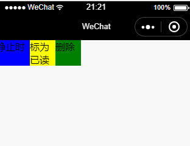

# slide-view

本项目fork自微信官方的[slide-view组件](https://github.com/wechat-miniprogram/slide-view)。但原组件存在一点小问题，同时不支持自定义事件。而在实际应用中，我们经常需要对组件做一些自定义的处理，为此我对组件做了点修改，同时提交了pull request，但是目前没有被merge。改动的内容和改动后支持的功能如下：

+ 修复滑动后没有恢复初始状态的问题
+ 增加`reset`,`end`, `move`等事件回调
+ 组件新增`_expand`属性，用于标记组件的展开状态
+ 新增监听器`autoReset`，通过监听器设置为`true`将组件reset到初始状态

原文文档：[点击这里查看](https://github.com/wechat-miniprogram/slide-view/blob/master/README.md)
小程序自定义组件

> 使用此组件需要依赖小程序基础库 2.2.1 以上版本，同时依赖开发者工具的 npm 构建。具体详情可查阅[官方 npm 文档](https://developers.weixin.qq.com/miniprogram/dev/devtools/npm.html)。

## 使用效果



> PS：此组件默认只携带基本样式，若想要获得上图中的效果，可参考 [tools/demo](./tools/demo/pages/index/index.wxss) 中的例子实现。

## 使用方法

1. 安装 slide-view

下载包，然后将`src`目录下的文件拷贝至项目的组件目录，如`/components/slideview`

2. 在需要使用 slide-view 的页面 page.json 中添加 slide-view 自定义组件配置

```json
{
  "usingComponents": {
    "slide-view": "/components/slideview/index"
  }
}
```

3. WXML 文件中引用 slide-view

每一个 slide-view 提供两个`<slot>`节点，用于承载组件引用时提供的子节点。left 节点用于承载静止时 slide-view 所展示的节点，此节点的宽高应与传入 slide-view 的宽高相同。right 节点用于承载滑动时所展示的节点，其宽度应于传入 slide-view 的 slideWidth 相同。

``` xml
<slide-view class="slide" width="320" height="100" slideWidth="200">
  <view slot="left">这里是插入到组内容</view>
  <view slot="right">
    <view>标为已读</view>
    <view>删除</view>
  </view>
</slide-view>
```

**slide-view的属性介绍如下：**

| 属性名                   | 类型         | 单位         | 默认值                    | 是否必须    | 说明                                        |
|-------------------------|--------------|--------------|---------------------------|------------|---------------------------------------------|
| width                   | Number       | rpx          | 显示屏幕的宽度             | 是          | slide-view组件的宽度                        |
| height                  | Number       | rpx          | 0                         | 是          | slide-view组件的高度                        |
| slide-width             | Number       | rpx          | 0                         | 是          | 滑动展示区域的宽度（默认高度与slide-view相同）|
| bindend                 | Function     | 无           | null                      | 否          |组件展开后的回调，接收参数为当前组件实例|
| bindreset               | Function     | 无           | null                      | 否           |组件恢复至初始状态的回调，接收参数为当前组件实例 |
| bindmove               | Function     | 无           | null                      | 否           |组件滑动过程的回调，接收参数为`{target: Object, event: Object}`，其中target当前组件实例，event为当前事件对象 |
| autoReset              | Boolean      | 无           | false                     | 否          | 监听器，只有设置为true时会触发，触发后组件自动恢复至初始状态| 


4. 官方组件存在的问题

展开组件后，再滑动组件一小段距离，组件无法恢复到初始状态，如下：


修复后如下：


5. Demo


监听器使用的例子：[源码](./tools/demo2)


